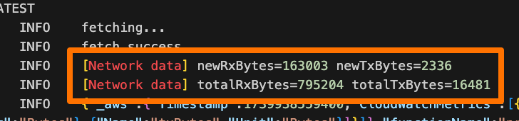
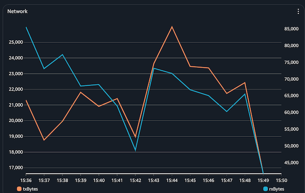
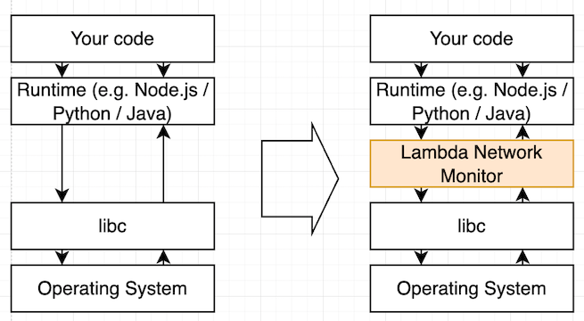
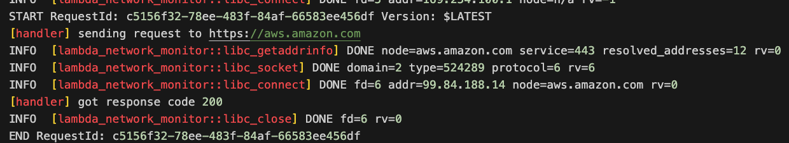

# Lambda network monitoring

This repo contains sample projects for functionality discussed in [this blog](https://aws.amazon.com/blogs/compute/monitoring-network-traffic-in-aws-lambda-functions/).

Attaching Lambda functions to a VPC allow you to have network monitoring for your function code. You can use VPC Flowlogs to auditing purposes and security groups/ACLs for access controls. 

In some scenarios, however, attaching a function to VPC might not be enough. For example, you might want to have fine-grained per-function or even per-invoke network monitoring, audit DNS resolutions and connection creations, or simply prefer not to introduce additional operational overhead of managing infrastructure.

This repo contains a sample project that illustrates how you can address above requirements regardless of whether you function attached to a VPC or not. Specifically, this repo will address two scenarios:
* Metering bytes in/out of your functions, with per-function and per-invoke granularity. This can be used for tenant charge backs or anomalous network activity detection.
* Intercepting network activity such as resolving DNS and establishing connections, per-function and per-invoke. 

> IMPORTANT: One major benefit of using VPC-attached Lambdas is clean separation between operational and application layers. Commonly VPC configurations are handled by a separate infrastructure/platform team, and application developers are not involved. Approaches described in this repo imply that the required network monitoring functionality is owned and implemented by function developers.  

There are two separate examples in this repo for two scenarios outlined above.
* The first is simple: it demonstrates how to parse the [/proc/net/dev](https://man7.org/linux/man-pages/man5/proc_pid_net.5.html) pseudo-file to obtain network device status information. 
* The second example is more advanced: it demonstrates how to leverage the  [Linux dynamic linker](https://en.wikipedia.org/wiki/Dynamic_linker) and LD_PRELOAD mechanism to intercept  `libc` network-related method calls.

> IMPORTANT: Techniques demonstrated in this repo are provided for educational purposes only and assume you have a solid understanding of Linux fundamentals as well as experience building software with Rust. You should always test your code thoroughly before deploying to production.

## Project structure

* `/stacks` contains two CDK stack definitions to deploy the sample code to AWS
* `/lambda-egress-bytes-counter` is a Node.js function illustrating how to retrieve data from `/proc/net/dev`, parse it, and calculate bytes in/out on every invocation. The sample implements this logic as part of the function; however, depending on your use-case, you can alternatively implement it as a [Lambda extension](https://docs.aws.amazon.com/lambda/latest/dg/lambda-extensions.html) or handler wrapper. 
* `/lambda-network-monitor-rust` - this folder contains Rust implementation of the Lambda Network Monitor layer. It uses the LD_PRELOAD mechanism described below to intercept `libc` calls. The code intercepts the following `libc` calls
  * `getaddrinfo` - use DNS to resolve name to IP addresses
  * `socket` - create a new socket
  * `connect` - establish connection on a socket
  * `close` - close socket
* `/lambda-network-monitor-layer` - this is the folder where Lambda layer is assembled. It has the wrapper script that injects the LD_PRELOAD environment variable (optional, you can just add the env var yourself). This is also the folder you need to copy the `.so` binary you get after building the Rust code in `/lambda-network-monitor-rust`. **Note** that this step is done via CDK (see step-by-step instructions below).
* `/lambda-network-monitor-demo-functions` - two simple demo functions (Node.js and Python) that you can use to see the Lambda Network Monitor layer in action. 

## Reading network device data from /proc/net/dev
This method is suitable when you need to obtain the OS-level stats, such as meter transferred bytes. You can use it to implement tenant chargeback or detect network traffic pattern changes. The method is based on the proc pseudo-filesystem (also known as procfs) available in Linux OS, which provides an interface to kernel data. Procfs allows you to read OS-level process information. For example, reading `/proc/cpuinfo` and `/proc/meminfo` pseudo-files provides information about current CPU and memory state. For network specifically, you can read the `/proc/net/dev` pseudo-file, which includes the list of network interfaces with detailed statistics for network device traffic.

See the implementation source code [here](./lambda-egress-bytes-counter). The code will print logs with network stats, as well as emit custom CloudWatch Metrics corresponding to sent/received bytes. 





## Intercepting libc network-related methods with LD_PRELOAD

Neither your function code nor the runtime (e.g. Node.js/Python/Java) communicate with network devices directly. This is handled by the operating system. The programmatic API you use in your code for network activities is an abstraction on top of the OS-level functionality. On Linux, applications use the [C standard library](https://en.wikipedia.org/wiki/C_standard_library), also known as [libc](https://en.wikipedia.org/wiki/C_standard_library), to communicate with the OS. When you start your application, the operating system will dynamically link it with the libc library, available as part of the OS. 

Linux OS has a facility allowing you to hook into the linking process and add your own shared libraries in between. This is done by setting the `LD_PRELOAD` environment variable with the value being a path to the `.so` file implementing required hooks. 



Once attached to a Lambda function, the code implementing required hooks can intercept libc calls and prints concise logs for network activity, such as DNS resolution, sockets opened/closed, connections established.



### Sample implementation

Below is a sample code snippet illustrating how to intercept the [getaddrinfo](https://man7.org/linux/man-pages/man3/getaddrinfo.3.html) libc call. This call is used for DNS resolution. There are two major components to this implementation.
* Persist a reference to the original `getaddrinfo` function in libc. You will need to call it once you're done with your business logic.
* Create your own implementation of `getaddrinfo`, which can implement custom business logic, and eventually call to the previously persisted original `getaddrinfo` function in libc.

See comments inline.

```rust
// Defining a new type that will match the getaddrinfo signature
#[allow(non_camel_case_types)]
pub type getaddrinfoFn = extern "C" fn(
    node: *const c_char,
    service: *const c_char,
    hints: *const addrinfo,
    res: *mut *mut addrinfo,
) -> c_int;

// Obtaining a reference to the real getaddrinfo implementation in libc.
#[allow(non_upper_case_globals)]
pub static LIBC_GETADDRINFO: Lazy<getaddrinfoFn> = Lazy::new(|| {
    let fn_name = CString::new("getaddrinfo").unwrap();
    let fn_ptr = unsafe { libc::dlsym(libc::RTLD_NEXT, fn_name.as_ptr()) };
    if fn_ptr.is_null() {
        log::error!("Failed to load *getaddrinfo() in libc from dlsym()");
    }
    unsafe { std::mem::transmute(fn_ptr) }
});

// Implementing a "proxy" implementation for getaddrinfo
#[no_mangle]
pub extern "C" fn getaddrinfo(
    node: *const c_char,
    service: *const c_char,
    hints: *const addrinfo,
    res: *mut *mut addrinfo,
) -> c_int {
    // Do whatever you need here, for example log node info
    
    // Call the original getaddrinfo method in libc and return the result
    let rv = LIBC_GETADDRINFO(node, service, hints, res);
    rv
}
```

## Building the Lambda Network Monitor with Rust

1. You need to have Rust and Cargo installed on a Linux machine to build this sample, follow instructions [here](https://www.rust-lang.org/tools/install). Use Docker if you're on Mac/Windows. 
2. Switch to `/lambda-network-monitor-rust` and run `cargo build`. This will build your code and produce `/lambda-network-monitor-rust/target/debug/liblambda_network_monitor.so` file. This is the binary that goes into the function layer. 
3. See the `/stacks/ld-preload-stack.js`. In lines 14-17, the .so file from previous step is copied to `/lambda-network-monitor-layer`. This will be done every time you run the `cdk deploy`.
4. In the same CDK stack file you can two functions - `lambda-network-monitor-demo-function-nodejs` and `lambda-network-monitor-demo-function-python`. These functions demonstrate the usage of Lambda Network Monitor layer.

## Deployment Instructions

#### Pre-reqs

* [AWS account](https://portal.aws.amazon.com/gp/aws/developer/registration/index.html)
* [AWS CLI](https://docs.aws.amazon.com/cli/latest/userguide/install-cliv2.html) 
* [Git](https://git-scm.com/book/en/v2/Getting-Started-Installing-Git)
* [AWS Cloud Development Kit](https://aws.amazon.com/cdk/)
* [Rust and Cargo](https://www.rust-lang.org/tools/install) 

1. Clone this GitHub repository:
    ```bash 
    git clone https://github.com/aws-samples/sample-lambda-network-monitor
    cd sample-lambda-network-monitor
    ```
   
1. Install CDK dependencies
    ```bash
    npm install
    ```
1. Install the stack illustrating the `procfs` method
    ```bash
    cdk deploy LambdaNetworkMonitor-Procfs
    ```
   
1. Invoke a newly created function and see the log output

    ```bash
    aws lambda invoke \
    --function-name proc-net-dev-demo-function \
    --log-type Tail \
    --query 'LogResult' \
    --output text \
    out.txt | base64 -d
    ```
    See invocation results include network data
    ```
    INFO	[Network data] thisInvokeRxBytes=150993 thisInvokeTxBytes=3834
    INFO	[Network data] totalRxBytes=549933 totalTxBytes=18030
    ```

1. Switch to `/lambda-network-monitor-rust` and build the `.so`. This MUST be done on a Linux machine. 
   ```bash
   cd lambda-network-monitor-rust
   cargo build
   ```

1. Confirm that the build was successful and a new file was created at `/lambda-network-monitor-rust/target/debug/liblambda_network_monitor.so`

1. Switch back to the `sample-lambda-network-monitor` directory, and use AWS CDK to deploy the second stack
    ```bash
    cdk deploy LambdaNetworkMonitor-LdPreload
    ```

1. Check deployment log, make sure that the `.so` file was copied successfully
    ```bash
    Copied liblambda_network_monitor.so
    ```

1. Invoke a newly created function and see log output
    ```bash
    aws lambda invoke \
    --function-name lambda-network-monitor-demo-function-python \
    --log-type Tail \
    --query 'LogResult' \
    --output text \
    out.txt | base64 -d
    ```
   
   See invocation results include network data
    ```
    START RequestId: aa2cbcaf-e947-4d46-97f0-9f18f001fad5 Version: $LATEST
    [handler] sending request to https://aws.amazon.com
    INFO  [lambda_network_monitor::libc_getaddrinfo] DONE node=aws.amazon.com service=443 resolved_addresses=12 rv=0
    INFO  [lambda_network_monitor::libc_socket] DONE domain=2 type=524289 protocol=6 rv=6
    INFO  [lambda_network_monitor::libc_connect] DONE fd=6 addr=99.84.188.14 node=aws.amazon.com rv=0
    [handler] got response code 200
    INFO  [lambda_network_monitor::libc_close] DONE fd=6 rv=0
    END RequestId: aa2cbcaf-e947-4d46-97f0-9f18f001fad5    
   ```
   
### Cleanup

Delete both stacks with `cdk destroy`

----
Copyright 2025 Amazon.com, Inc. or its affiliates. All Rights Reserved.

SPDX-License-Identifier: MIT-0
